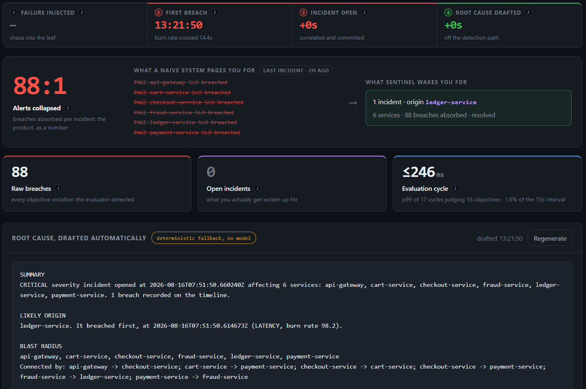
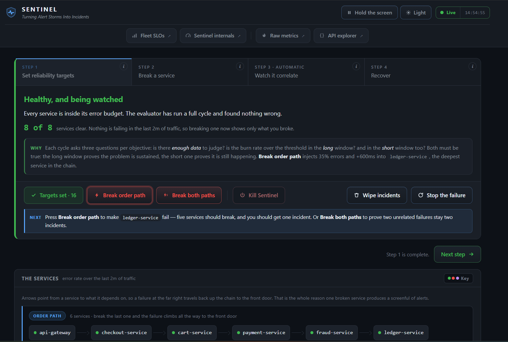
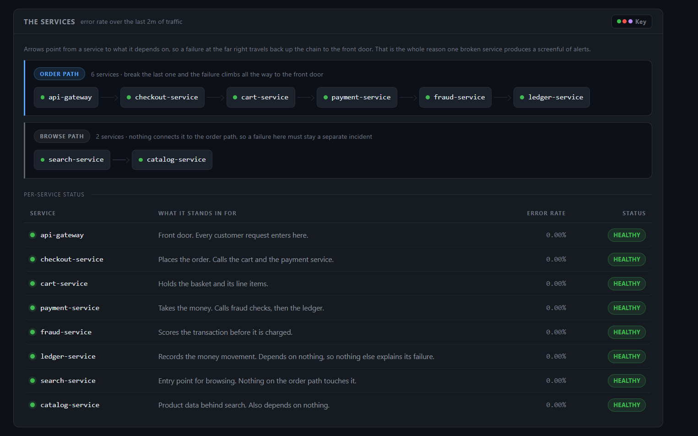
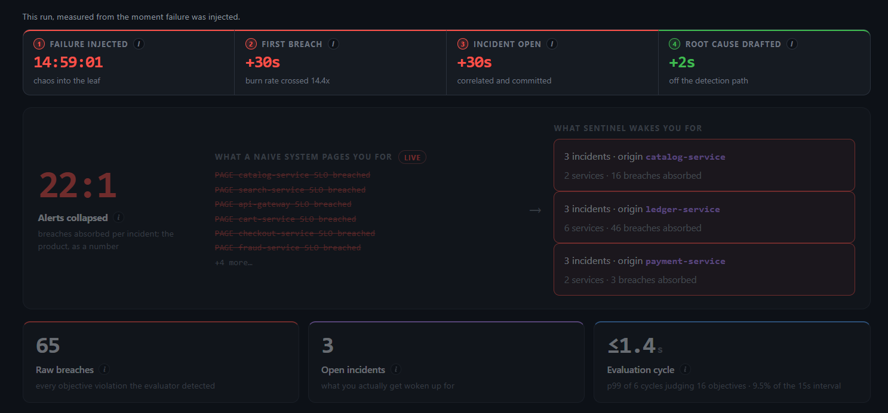
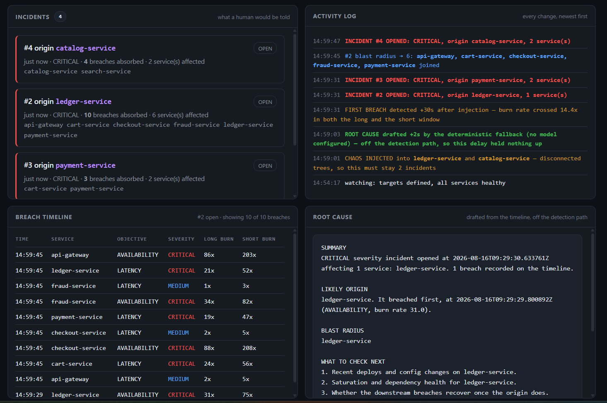
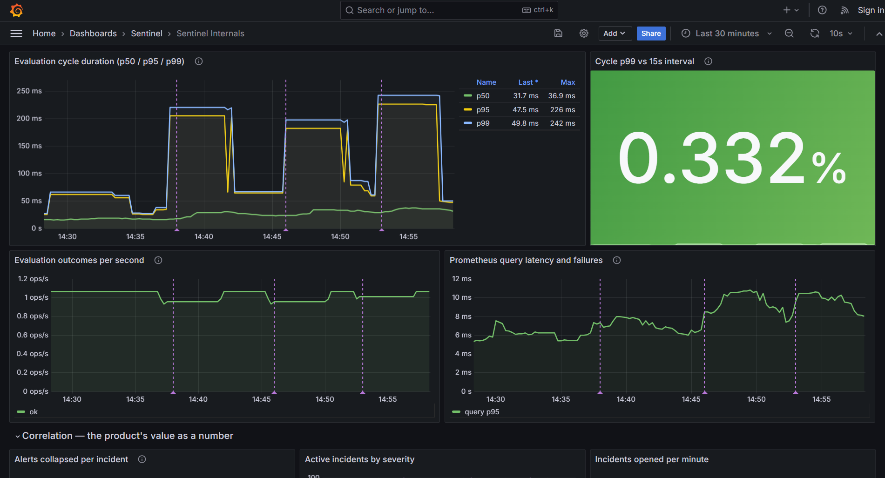
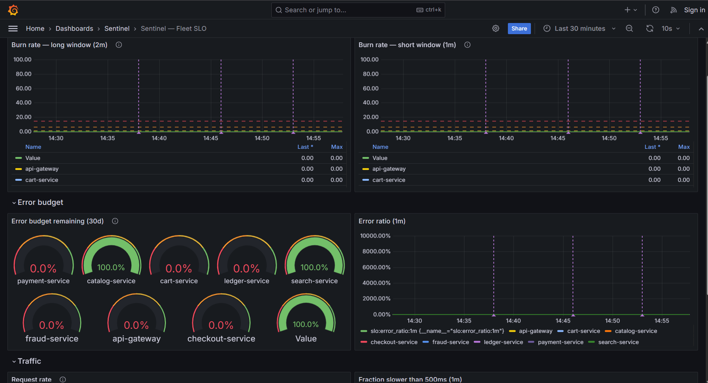
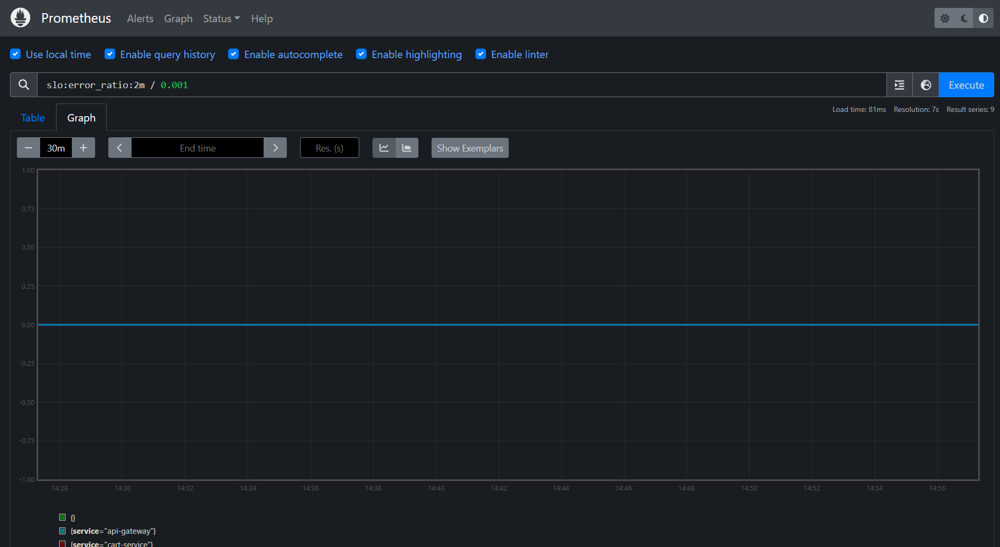

# Sentinel

**SLO and incident intelligence for a service fleet.** Sentinel decides when services have broken
their reliability promise, and turns the resulting alert storm into a single incident with a complete drafted
explanation.

[](https://github.com/CodeTirtho97/Sentinel/actions/workflows/ci.yml)


---

`ledger-service` degrades at 2am. Everything downstream — payments, cart, checkout — starts failing
too. The on-call engineer wakes to 60 alerts that are all the same problem and spends twenty minutes
doing correlation in their head before they can start fixing anything.

Sentinel does three things Prometheus deliberately does not:

- **Error budget accounting** — multi-window burn rate over a rolling window, so an alert means
  "you are consuming your budget too fast", not "a threshold moved"
- **Correlation** — dependency-related breaches become one incident, not N alerts
- **Lifecycle and AI RCA** — incidents move through a state machine; an LLM drafts a root-cause
  hypothesis from the correlated timeline, with a deterministic fallback when no model is configured



<sub>**The whole product in one screen.** `ledger-service` was broken; 88 breaches landed across six
connected services. A conventional setup pages you once per line on the left. Sentinel raises **one**
incident, names `ledger-service` as the origin, and drafts the root cause — here from the
deterministic summariser, because no API key was set.</sub>

## Quickstart

Requires Docker Desktop. Java and Maven come from the containers.

```bash
docker compose up -d --build --wait      # any OS, any shell — no make, no scripts
```

That is the whole quickstart. There is no `make` step, no shell script and no environment variable
to export first — the compose file already defaults `SPRING_PROFILES_ACTIVE` to `demo`, and `--wait`
blocks until every health check passes, so when the command returns the stack is genuinely ready.

Open **<http://localhost:3000>** and press **Start demo**.



<sub>Four guided steps across the top, the live state in plain words, and a **NEXT** line that always
names the button to press — so the page is never waiting on you without saying so. Seeding, breaking
a service, killing the process and resetting are all buttons; nothing here needs a terminal.</sub>

| | |
|---|---|
| Demo console | <http://localhost:3000> |
| Swagger UI | <http://localhost:3000/swagger-ui.html> |
| Grafana | <http://localhost:3001> (anonymous, no login) |
| Prometheus | <http://localhost:9090> |

The demo **works with no LLM API key** — root-cause drafts come from the deterministic timeline
summariser instead of a model. Set `LLM_API_KEY` for model-written narratives.

The API is behind a static key, `local-dev-key` by default:

```bash
curl -H 'X-Api-Key: local-dev-key' localhost:3000/api/v1/incidents
```

Prefer a terminal? `./scripts/demo.sh seed | break | break-both | reset | kill | status` drives the
same actions. Tear down with `docker compose down -v`.

## How to run

Every command below is identical on PowerShell, cmd, macOS and Linux. `make` is **not** required and
is not used for the demo or the build — it survives only for the load-test measurement sequence and
the kind/Helm path, which are genuinely multi-step. Run `make help` to see what is left.

> **Windows:** in PowerShell, `curl` is an alias for `Invoke-WebRequest` and does **not** accept
> `-X` or `-H`. Write `curl.exe` instead; it ships with Windows 10 and later.

### Start and stop

```bash
docker compose up -d --build --wait
```

Builds the images and starts all fifteen containers: Postgres, Redpanda, Redis, Prometheus, Grafana,
the eight-service demo fleet, the k6 baseline traffic generator and Sentinel. `--wait` blocks until
every health check passes, so when it returns the stack is genuinely ready. Takes a few minutes cold,
about 25 seconds warm.

```bash
docker compose down -v
```

Stops everything and drops the volumes, so the next start comes up with an empty database: no SLOs,
no incidents, back to step 1 of the demo. Omit `-v` to keep incident history across a restart.

```bash
docker compose ps                        # what is running, and each container's health
docker compose logs -f sentinel          # follow the platform's own logs
```

### Drive the demo from a terminal

Every button on the demo page is one API call, and [`scripts/demo.sh`](scripts/demo.sh) is a thin
wrapper over the same endpoints:

```bash
./scripts/demo.sh seed         # 16 objectives — one availability, one latency, per service
./scripts/demo.sh break        # 35% errors and +600 ms into ledger-service
./scripts/demo.sh break-both   # ledger-service AND catalog-service
./scripts/demo.sh reset        # clear all injected failure
./scripts/demo.sh kill         # halt the process mid-incident; Docker restarts it
./scripts/demo.sh status       # fleet health and current chaos state
```

`break` targets the deepest node in the order path, which should produce **one** incident naming it
as origin. `break-both` additionally breaks the disconnected browse path, which should produce
**two** — the negative case that proves correlation groups by dependency rather than by timing.

The script holds no SLO parameters, service list or chaos rates of its own; `DemoControlController`
owns all of that, so the terminal path and the buttons cannot drift apart. All of `/api/v1` sits
behind a static key, `local-dev-key` unless you set `SENTINEL_API_KEY`, so the raw calls work too:

```bash
curl -X POST -H 'X-Api-Key: local-dev-key' 'localhost:3000/api/v1/demo/seed'
curl -X POST -H 'X-Api-Key: local-dev-key' 'localhost:3000/api/v1/demo/chaos?services=ledger-service'
curl         -H 'X-Api-Key: local-dev-key' 'localhost:3000/api/v1/incidents'
```

`./scripts/watch-incidents.sh` narrates incidents as they open, attach and resolve.

These endpoints exist only under the `demo` profile and return 404 in any other. That is deliberate:
an endpoint that can break its own fleet, or halt the process, has no business being reachable in
production.

### Editing the demo page

`static/demo.html` is compiled into the jar, so editing it normally changes nothing in a running
container until a full Maven rebuild — the container serves the copy that was packaged.

A `docker-compose.override.yml` fixes that. Compose merges it automatically on every
`docker compose up`, with no extra flag:

```yaml
services:
  sentinel:
    volumes:
      - ./sentinel-platform/src/main/resources/static:/app/static:ro
    environment:
      SPRING_WEB_RESOURCES_STATIC_LOCATIONS: "file:/app/static/,classpath:/META-INF/resources/,classpath:/resources/,classpath:/static/,classpath:/public/"
      SPRING_WEB_RESOURCES_CACHE_PERIOD: "0"
      SPRING_WEB_RESOURCES_CHAIN_CACHE: "false"
```

`file:` first shadows the packaged copy, and the two cache settings stop Spring and the browser
serving a stale one. A browser refresh becomes the whole loop.

The file is **gitignored**, so it is per-machine rather than something a reviewer inherits — paste the
block above into `docker-compose.override.yml` at the repository root to enable it. Note that it
shadows the jar rather than updating it: rebuild with `docker compose up -d --build sentinel` before
recording anything, so what you record is the file the image actually contains.

### Build and test

These need a JDK; the Maven wrapper fetches Maven itself. On Windows use `mvnw.cmd`.

```bash
./mvnw verify                            # unit + Testcontainers integration suite
./mvnw test                              # unit only, no Docker, seconds
./mvnw -DskipTests package               # build without testing
./mvnw -pl sentinel-platform verify      # JaCoCo → target/site/jacoco/index.html
./mvnw spotless:apply                    # apply formatting — CI fails on spotless:check
```

`verify` starts real Postgres, Redpanda and Redis through Testcontainers, so it needs Docker running
and takes a few minutes. `test` needs neither and is the one to run while working. Mutation testing
is scoped to `slo.math` alone — line coverage proves the tests ran, mutation coverage proves they
would have failed had the arithmetic been wrong:

```bash
./mvnw -pl sentinel-platform test-compile org.pitest:pitest-maven:mutationCoverage
```

### Load testing

The load-test overlay swaps the eight-service demo fleet for the synthetic exporter, because eight
extra JVMs competing for the same cores would measure the laptop rather than the evaluator. Full
detail in [loadtest/README.md](loadtest/README.md).

```bash
SYNTHETIC_SERVICES=100 docker compose -f docker-compose.yml -f docker-compose.loadtest.yml \
  up -d --build postgres redpanda redis prometheus grafana synthetic-exporter sentinel   # make load-test-up
docker compose -f docker-compose.yml -f docker-compose.loadtest.yml down -v              # make load-test-down
```

The measurements themselves run k6 in a container and are wrapped by `make load-test-seed`,
`load-test-storm`, `load-test-replay` and `load-test-recovery`. **Run `load-test-seed` first** —
nothing is evaluated until SLOs exist, and skipping it measures an empty cycle. `make load-test` runs
the full 100/250/500 ramp end to end and takes around 75 minutes.

### Kubernetes

The secondary path, and the one place `docker compose` genuinely cannot substitute — it needs `kind`,
`kubectl` and `helm`. Compose remains the primary target; nothing here is required for the demo.

```bash
make kind-demo      # cluster, image side-load, and helm install, in three named steps
make kind-status    # pods, and what each probe currently says
make kind-drain     # delete the sentinel pod mid-stream; nothing may be lost
make kind-down
```

`make helm-lint` renders and lints the chart without needing a cluster at all. See
[k8s/README.md](k8s/README.md) for what this does and, honestly, what it does not demonstrate.

## Architecture

```
┌──────────────────────────────────────────────┐
│ demo-fleet — 8 instances of ONE image        │
│                                              │
│ ORDER PATH                                   │
│  api-gateway → checkout → cart ─┐            │
│                   └→ payment ←──┘            │
│                        └→ fraud → ledger     │
│                                              │
│ BROWSE PATH  (no edge to the order path)     │
│  search → catalog                            │
└───────────────────┬──────────────────────────┘
                    │ /actuator/prometheus
                    ▼
      ┌──────────────────────────────┐
      │ Prometheus                   │
      │ + recording rules            │
      │   (burn rate precomputed)    │
      └───────────────┬──────────────┘
                      │ 30 instant queries per cycle, any fleet size
                      ▼
      ┌──────────────────────────────────────┐
      │ sentinel-platform                    │
      │                                      │
      │   SloEvaluator ──15s──▶ MetricsSource│
      │        │ SloBreachEvent              │
      │        ▼                             │
      │   [Kafka: slo.breach.v1]             │
      │        ▼                             │
      │   BreachConsumer ─▶ CorrelationStore │
      │        │                    (Redis)  │
      │        ▼                             │
      │   IncidentService ─────▶ Postgres    │
      │        │ incident.opened.v1          │
      │        ▼                             │
      │   RcaConsumer ──▶ RcaDrafter         │
      └───────────────┬──────────────────────┘
                      ▼
                  Grafana
```

`demo-fleet` is one Spring Boot app run eight times with different environment variables. Calls
between instances are synchronous, so breaking a leaf cascades to the root.

**The two trees share no edge, deliberately.** A single connected fleet can only demonstrate the
positive case. With two, you can break a leaf in each and check Sentinel reports *two* incidents —
the half of the proof that it groups what is connected rather than what merely broke at the same
moment.



<sub>Arrows point from a service to what it depends on, so failure travels **right to left** — break
`ledger-service` and it climbs all the way to `api-gateway`. That is why one broken service produces
a screenful of alerts, and it is the structure correlation walks.</sub>

| Break | Result |
|---|---|
| `ledger-service` | **6 services → 1 incident**, origin `ledger-service` |
| `ledger` + `catalog` | **2 incidents** — 6 services from `ledger-service`, 2 from `catalog-service` |

Breach counts vary with how long chaos runs; the run pictured above absorbed 88 into one incident.

## How it works

### Burn rate

`errorBudget = 1 - objective`, `burnRate = errorRate / errorBudget`. A burn rate of 1.0 exhausts the
budget exactly at window end. A severity fires only when **both** its windows exceed the threshold —
the short window is what stops an alert firing long after recovery.

| Severity | Long | Short | Threshold | Budget consumed |
|---|---|---|---|---|
| `CRITICAL` | 1h | 5m | 14.4 | 2% |
| `HIGH` | 6h | 30m | 6.0 | 5% |
| `MEDIUM` | 3d | 6h | 1.0 | 10% |

Insufficient data is never a breach. Zero traffic, too few events, a partial window or an
unreachable Prometheus all return `InsufficientData` — **Sentinel failing must not manufacture
incidents.**

Burn rate is precomputed in Prometheus recording rules, so the evaluator issues a constant 30 instant
queries per cycle whether the fleet is 8 services or 500.

### Correlation

A breach enters a Redis sorted set scored by detection time. The consumer reads the last five
minutes, builds the subgraph of the dependency topology **induced by the breaching services only**,
and takes the weakly connected component containing this service as the blast radius. The origin is
the earliest breach in that component, ties broken by depth in the call chain.

The incident is keyed on the **origin service**, not a hash of the member set — the member set grows
as a cascade spreads, so hashing it produces a new incident per breach, which is exactly the alert
storm this exists to collapse.

Duplicate delivery is absorbed at three ordered layers: a deterministic event ID makes redelivery
recognisable, a Redis dedupe key set **after** commit skips work already done, and a partial unique
index on `incident` catches the commit↔mark race.



<sub>**The negative case, which is what makes the positive one mean anything.** Both leaves broken at
the same instant. A system that grouped by timing would report one incident spanning everything;
Sentinel keeps them apart because `catalog-service` and `ledger-service` share no dependency edge.
The ribbon along the top times the pipeline from injection: first breach at +30s, incident committed
at +30s, root cause drafted +2s later — off the detection path, so it held nothing up.</sub>

### Incident lifecycle

```
OPEN → ACKNOWLEDGED → MITIGATED → RESOLVED
OPEN → RESOLVED            (auto-resolve)
ACKNOWLEDGED → RESOLVED
```

Anything else is a 409 with an RFC 7807 body naming the allowed targets. An incident whose members
go quiet for `2 × correlation window` auto-resolves; the scheduler reads an injected `Clock`, so the
test advances time rather than sleeping.

### AI root cause analysis

`incident.opened.v1` triggers a drafter asynchronously — a ten-second model call has no business
near a fifteen-second evaluation cycle. `TimelineBuilder` assembles compact structured facts (the
incident, the induced dependency edges, the ordered breach timeline) rather than a raw dump, and the
prompt forbids inventing log lines or deploys.

With no API key, `TemplateRcaDrafter` writes the same four sections from the same timeline,
deterministically. The response always says which wrote it, because a template summary and a model
narrative deserve different amounts of trust.



<sub>Four views of the same event, side by side, because the interesting part is how they line up in
time: a breach lands in the timeline, an incident absorbs it, the log records when, the drafter
explains it. The activity log is the audit trail — every state change, blast-radius widening and
correlation decision, in order.</sub>

## Why not just Prometheus + Alertmanager?

Recording rules compute burn rate; Alertmanager groups and inhibits. What they do not give you: a
stateful incident entity with a lifecycle, dependency-aware cross-service correlation, error budget
accounting that survives restarts, or queryable incident history for postmortems. That is the layer
PagerDuty and incident.io sell. This is a minimal open version of it.

## Dashboards

Two Grafana dashboards are provisioned as JSON, so they exist on first boot with zero clicking.
Anonymous access is enabled — there is no login step.

**Sentinel Internals** — Sentinel watching itself. This is the operations view.



<sub>`Cycle p99 vs 15s interval` is the ceiling metric: at 100% the evaluator can no longer keep up.
The steps in the p95/p99 trace are chaos injections — cycle cost rises from ~60 ms to ~220 ms while
sixteen objectives are actually breaching, still **0.332% of the interval budget**. Vertical dashed
lines are annotations marking incidents opened and process restarts.</sub>

**Fleet SLO** — the product view: burn rate per service against the 1× / 6× / 14.4× threshold lines,
error budget gauges, and request rate. Template variables switch the objective and both windows.



<sub>Check **Request rate** first. If it is flat at zero the baseline load generator has stopped,
`rate()` has nothing to average, and every burn rate here is meaningless rather than healthy. The
30-day error-budget gauges read 0% until the stack has 30 days of history — expected on a fresh
start, not a fault.</sub>

Prometheus itself is a query console, not a dashboard — it opens blank on purpose. Every link out of
the demo console carries its expression in the URL, so it lands on a drawn graph:



<sub>The **Look At The Raw Data** tab on the demo console lists eight of these with the query and an
explanation of what it answers. The pair worth running back to back is
`slo:error_ratio:2m` and the raw `rate(...)` expression that computes the same thing at query time —
identical lines, one precomputed. That is the whole recording-rules argument in ten seconds.</sub>

## API

Base `/api/v1`, behind an `X-Api-Key` header compared with `MessageDigest.isEqual` rather than
`String.equals`. Actuator and Swagger sit outside the fence — Prometheus scrapes one and Kubernetes
probes it, and the other is documentation.

```
POST   /slos                             create                      201 / 400 / 409
GET    /slos                             list                        200
GET    /slos/{id}                                                    200 / 404
PATCH  /slos/{id}                        enable/disable, retarget    200 / 404
DELETE /slos/{id}                                                    204 / 404
GET    /slos/{id}/budget                 burn rate + budget left     200 / 404

GET    /incidents?state=&severity=&since=&page=&size=                200
GET    /incidents/{id}                   detail + timeline           200 / 404
POST   /incidents/{id}/transition        {"to":"ACKNOWLEDGED"}       200 / 404 / 409
GET    /incidents/{id}/rca               drafted hypothesis          200 / 202 / 404
POST   /incidents/{id}/rca:regenerate    redraft                     202 / 404

GET    /services                         fleet + dependency edges    200
```

`GET /rca` answers **202 while a draft is still being written**, so a poller can tell "not yet" from
"here it is" without inspecting the body. Errors are RFC 7807 `ProblemDetail`.

Every fleet instance also exposes chaos injection on its own port — `api-gateway` 8081 through
`catalog-service` 8088, in the order listed in `docker-compose.yml`:

```bash
curl -X POST 'localhost:8086/chaos/errors?rate=0.3'   # ledger-service: 30% of requests return 500
curl -X POST 'localhost:8086/chaos/latency?ms=600'
./scripts/demo.sh reset                               # reset the whole fleet
```

## Testing

```bash
./mvnw test                          # unit tests, no Docker, ~15s
./mvnw verify                        # + Testcontainers suite (real Postgres, Redpanda, Redis)
./mvnw -pl sentinel-platform test-compile org.pitest:pitest-maven:mutationCoverage
./mvnw -pl sentinel-platform verify  # JaCoCo, gate at line ≥75% / branch ≥65%
```

Real containers, because mocked brokers hide serialization and rebalance bugs. The suite is weighted
towards failure paths rather than happy paths:

| Scenario | Assertion |
|---|---|
| Cascade | four connected breaches in-window → **one** incident, origin `ledger-service` |
| No false correlation | two unconnected breaches → **two** incidents |
| Idempotency | 50 threads on one key → exactly one incident, one opener |
| Redelivery | 50 deliveries of one event → one timeline entry |
| Dead letter | malformed payload → DLT, next valid message still processes |
| Consumer restart | backlog released after restart → nothing lost, nothing duplicated |
| Auto-resolve | injected clock advanced past the quiet period → RESOLVED, no sleeping |
| Sharding | two shards evaluate disjoint service sets whose union is complete |
| LLM failures | 500s, 429s and empty 200s → retries, then the deterministic summary, no dead letter |
| API key | missing, wrong and prefix-of-correct keys all 401 |
| Kubernetes probes | unready without partition assignment; a dead metrics source leaves liveness at 200 |

CI runs formatting, unit tests, mutation testing, the Testcontainers suite behind the coverage gate,
a Docker build from a clean checkout, and a Helm lint plus schema validation of the rendered chart.

## Kubernetes

Compose is the primary path; Kubernetes is a working second target.

```bash
make kind-demo     # cluster, images, helm install — same URLs as Compose
make kind-drain    # delete the pod mid-incident; nothing lost, nothing duplicated
```

Readiness is tied to **Kafka partition assignment** and metrics-source reachability, not just an open
port — a replica with no partitions serves the API perfectly while consuming nothing. Graceful drain
means `preStop`, 30s of Spring shutdown, and manual acks, so an evicted pod's in-flight message is
reprocessed rather than lost. Sharding is one Helm flag. Details, and an honest list of what the
deployment is *not*, in [k8s/README.md](k8s/README.md).

## Performance

Measured on a single instance (`shardCount=1`), Intel Core Ultra 5 125H, Docker VM limited to
8 GB / 8 cores. Full method and raw output in
**[`docs/LOAD_TEST_RESULTS.md`](docs/LOAD_TEST_RESULTS.md)**.

| | Measured |
|---|---|
| **Alert collapse** | **5.00 : 1** — 2,000 failing services → **400 incidents**, mean correlated component size 5.00 |
| **Scale** | **8,000 SLOs across 4,000 synthetic service series**, evaluated every 15s |
| **Cycle latency** | **p99 ≤ 500 ms** — 3.3% of the interval, **30× headroom**; ceiling not reached |
| **Query cost** | **constant 30 instant queries**, independent of fleet size |
| **Detection** | 123–138s from injection to incident, against 115s predicted from the burn-rate maths |
| **Idempotency** | 10,000 duplicate events → **exactly 1 incident**, 1 timeline row, 0 dead-letters |
| **Recovery** | **40s** from `docker kill` mid-cycle to evaluating again, zero duplicate incidents |
| **Under storm** | 50% of the fleet breaching: consumer lag bounded 182–356, memory 31–33% of the VM |

Cycle cost is linear in fleet size with a shallow slope — `32.2 ms + 0.0497 ms/service`,
R² = 0.9904 across a 40× range. **The test rig ran out of memory at ~16,000 series before the
evaluator ran out of interval budget**, so the ceiling quoted here is the laptop's, not the
system's.

**The load test is also where five real defects were found** — including a correlation read that was
quadratic in storm size, and an auto-resolver that silently closed 4,243 live incidents while their
services were still failing. Each is written up with its mechanism, fix and re-measured result in
[§6 of the results](docs/LOAD_TEST_RESULTS.md). Why each parameter has the value it does is in
[`docs/BENCHMARK_METHODOLOGY.md`](docs/BENCHMARK_METHODOLOGY.md).

## Known limitations

Stated deliberately rather than discovered later.

- **Time-window plus static-topology correlation, not causal inference.** It answers "these broke
  together and they are connected", not "this caused that". The dependency graph is configured.
- **Incidents never merge once opened.** `correlationKey` is frozen at creation, so two components
  that later connect stay two incidents.
- **A cascade can briefly open more than one incident** when the ends of a chain trip a cycle before
  its middle. The transient one auto-resolves once it stops receiving breaches.
- **Correlation is a hot key** — one Redis read per breach event, the wrong shape during a large
  incident. Measured: at 2,000 concurrently breaching services this put the consumer 18,310 messages
  behind before the window was reduced to service names. The `CorrelationStore` seam exists so it can
  move to a Kafka Streams state store at the next order of magnitude.
- **Readiness reports UP ~2.4s before the dependency graph is seeded.** `DependencySeeder` is an
  `ApplicationRunner`, so it runs after the web server starts answering. A breach arriving in that
  window correlates against an empty graph. Bounded to one startup window and does not corrupt later
  incidents, but the graph belongs in the readiness contract.
- **Recovery takes as long as the SLO window, not as long as the fix.** Burn rate is computed over a
  rolling window, so a service that stops failing keeps its incident open until the bad samples age
  out — roughly an hour on the production 1h window.
- **Single tenant, single evaluator instance.** Sharding is built and rendered by the Helm chart but
  has not been run under load.
- **The demo profile uses compressed SLO windows** so a cascade is visible in two minutes. Production
  defaults are the standard 1h/6h/3d.
- **The RCA is a hypothesis.** The model sees the incident, the induced edges and the timeline — no
  logs, no deploys, no config history.
- **The API key is a static shared secret, not an IAM.** No users, no orgs, no rotation.

## Project layout

```
sentinel-platform/     the product — SLO evaluation, correlation, incidents, RCA
demo-fleet/            one Spring Boot app, run as eight services
synthetic-exporter/    N fake service series, for load testing only
infra/                 Prometheus rules, provisioned Grafana dashboards
k8s/                   Helm chart and kind cluster
loadtest/              k6 scripts
docs/                  scaling analysis, benchmark methodology, design decisions
```

**Five seams**, the only abstractions in the project, each because it is a plausible swap:
`MetricsSource` (Thanos, Mimir), `EventPublisher` (in-memory for tests), `CorrelationStore` (Kafka
Streams), `RcaDrafter` (template fallback), `IncidentRepository`. Two rules keep them real: nothing
outside `slo.metrics` knows PromQL exists, and `slo.math` is pure Java — no Spring, no I/O, no
`Instant.now()` — which is why it is the only package under mutation testing.

## Documentation

| | |
|---|---|
| **[Load test results](docs/LOAD_TEST_RESULTS.md)** | **all five measurements, the hardware they were taken on, and the five defects the storm exposed** |
| [Design decisions](docs/DESIGN_DECISIONS.md) | why the incident is keyed on origin, why the dedupe key is set after commit, why the subgraph is induced, and the traps behind each |
| [Scaling](docs/SCALING.md) | back-of-envelope load, what breaks first and in what order, the fix for each |
| [Benchmark methodology](docs/BENCHMARK_METHODOLOGY.md) | the five measurements, why each parameter has its value, what a flat curve proves |
| [Kubernetes](k8s/README.md) | probes, graceful drain, sharding, and what the deployment is not |

## Stack

Java 21 (virtual threads, records, sealed interfaces) · Spring Boot 3.5 · PostgreSQL + Flyway ·
Kafka (Redpanda locally) · Redis · Prometheus + Grafana · Resilience4j · Spring AI · Testcontainers ·
WireMock · k6 · Helm + kind
